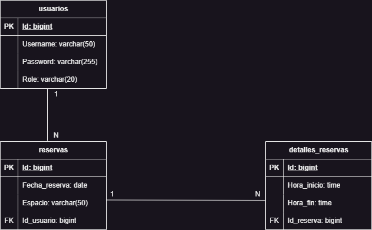

# ActivaT

## Idea del Proyecto
El proyecto consiste en una API REST diseñada para gestionar de forma sencilla y eficiente la reserva de espacios deportivos. Los usuarios podrán registrar cuentas, realizar reservas de espacios como pistas de tenis, pádel, natación, fútbol, y consultar los detalles de dichas reservas.

---

## Justificación del Proyecto
La gestión de reservas de espacios deportivos suele realizarse mediante procesos manuales o plataformas genéricas que no se ajustan a las necesidades específicas de los usuarios y administradores. Muchas veces esto no es nada cómodo/intuitivo. Este proyecto busca solucionar esta problemática ofreciendo:

1. **Automatización**: Digitalizar el proceso de reservas, evitando errores humanos y mejorando la experiencia del usuario.
2. **Facilidad de uso**: Diseñar una plataforma intuitiva para que cualquier usuario, sin importar su nivel técnico o edad, pueda gestionar sus reservas.
3. **Flexibilidad**: Permitir a los usuarios consultar y modificar sus reservas, adaptándose a sus horarios.
4. **Eficiencia administrativa**: Proveer herramientas para que los administradores gestionen los espacios y horarios disponibles de manera óptima.

En resumen, esta API facilitará el acceso a espacios deportivos y optimizará su gestión, tanto para usuarios como para administradores.

---

## Descripción Detallada de las Tablas

### 1. `usuarios`
Tabla que registra los usuarios de la API.

- **id**: Identificador único del usuario (clave primaria, autoincrementable).
- **username**: Nombre del usuario para realizar el login.
- **password**: Contraseña necesaria para la autenticación.
- **role**: Rol del usuario en el sistema (puede ser "usuario" o "admin").

---

### 2. `reservas`
Tabla que registra las reservas activas realizadas por los usuarios.

- **id**: Identificador único de cada reserva (clave primaria, autoincrementable).
- **fecha_reserva**: Fecha en la que el usuario realiza la reserva.
- **espacio**: Espacio reservado (por ejemplo, pista de tenis, fútbol, etc.).
- **usuario_id**: Relación directa con el usuario que realiza la reserva mediante su ID (clave foránea).

---

### 3. `detalles_reservas`
Tabla que almacena los detalles específicos de cada reserva.

- **id**: Identificador único de los detalles de una reserva (clave primaria, autoincrementable).
- **hora_inicio**: Hora en la que comienza la reserva del espacio.
- **hora_fin**: Hora en la que finaliza la reserva.
- **reserva_id**: Relación directa con la reserva a la que pertenecen los detalles mediante su ID (clave foránea).

---

## Funcionalidades Clave de la API

### Endpoints de Usuarios
- **POST /usuarios/register**: Registra un nuevo usuario en la plataforma.
- **POST /usuarios/login**: Inicia sesión con las credenciales del usuario.
- **GET /usuarios/{id}**: Obtiene información del usuario por su ID(Solo el admin)

---

### Endpoints de Reservas
- **POST /reservas**: Permite a un usuario realizar (crear) una nueva reserva.
- **GET /reservas**: Obtiene una lista de todas las reservas activas.
- **GET /reservas/{id}**: Obtiene una reserva específica.
- **DELETE /reservas/{id}**: Cancela (elimina) una reserva existente.

---

### Endpoints de Detalles de Reservas
- **GET /detalles_reservas/{reserva_id}**: Obtiene los detalles de una reserva específica.
- **POST /detalles_reservas/{reserva_id}**: Realiza detalles específicos en una reserva.

---

## Rutas y Seguridad

### Configuración de seguridad
A continuación, se muestran las rutas definidas y sus configuraciones de acceso en función de si son públicas, requieren autenticación o roles específicos:

- **POST /usuarios/register**: Permitida para todos (sin autenticación).
- **POST /usuarios/login**: Permitida para todos (sin autenticación).
- **GET /usuarios/{id}**: Solo permitido para admins.
- **POST /reservas**: Requiere autenticación. Solo los usuarios autenticados pueden crear reservas.
- **GET /reservas**: Requiere autenticación. Los usuarios autenticados solo pueden ver sus propias reservas.
- **GET /reservas/{id}**: Requiere autenticación. Un usuario puede ver su propia reserva.
- **DELETE /reservas/{id}**: Requiere autenticación. Un usuario puede eleminar sus propias reservas.
- **GET /detalles_reservas/{reserva_id}**: Requiere autenticación. Un usuario puede ver los detalles de sus propias reservas.
- **POST /detalles_reservas/{reserva_id}**: Requiere autenticación. Un usuario puede elegir detalles en su reserva.

## Diagrama Entidad-Relación

